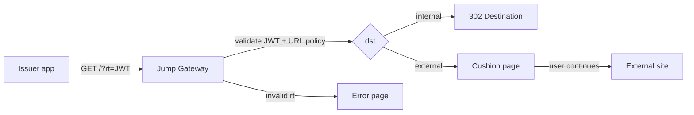

# UMAXICA Jump Gateway

Jump Gateway is a Hono-only, stateless redirect trust broker for `https://jump.example.net/?rt=<JWT>`.

Issuer applications create an `rt` compact JWS. Jump validates the JWT, issuer registry, JWKS signature, destination policy, and normalized URL before crossing FQDN boundaries. Internal destinations may receive a redirect. External destinations always receive a cushion page first.

This project will introduce integration examples before official libraries. Issuer applications should fully understand the JWTs they generate.

## Purpose

Jump exists to make redirect decisions server-side at an edge boundary instead of letting applications pass arbitrary URLs across domains. It reduces OpenRedirect risk, makes issuer-specific allowlists explicit, and gives external redirects a visible pause.

## NON-GOALS

- This project is NOT an authentication provider.
- This project is NOT a session manager.
- This project is NOT a generic proxy.
- This project is NOT a URL shortener.
- This project is NOT a confidential transport.
- This project does NOT hide redirect destinations.
- This project does NOT replace OAuth/OIDC.
- This project is ONLY a redirect trust broker across FQDN boundaries.

## Quick Flow



## Local Runtime Checks

Use these commands when you want to run the same Hono app through the target edge runtimes locally.

Both local servers bind to `0.0.0.0` through package scripts so they can be reached from outside a devcontainer when the port is forwarded. From inside the container, use `127.0.0.1`. From the host, use the URL shown by your editor or devcontainer port-forwarding UI.

Fastly Compute:

```sh
vp run fastly:build
vp run fastly:serve
curl http://127.0.0.1:7676/health.json
```

Expected health response includes:

```json
{
  "ok": true,
  "service": "jump",
  "version": "0.1.0",
  "edge": "fastly"
}
```

Cloudflare Workers:

```sh
vp run cloudflare:check
vp run cloudflare:dev
curl http://127.0.0.1:8787/health.json
```

Expected health response includes:

```json
{
  "ok": true,
  "service": "jump",
  "version": "0.1.0",
  "edge": "cloudflare"
}
```

Useful local checks for either runtime:

```sh
curl http://127.0.0.1:<port>/about
curl http://127.0.0.1:<port>/health.json
curl http://127.0.0.1:<port>/.well-known/jwks.json
curl http://127.0.0.1:<port>/robots.txt
```

Default ports:

- Fastly Compute: `7676`
- Cloudflare Workers: `8787`

If Fastly is reachable inside the container but not from the host, confirm that port `7676` is forwarded by the devcontainer or editor. If Cloudflare is reachable inside the container but not from the host, confirm that port `8787` is forwarded.

## Security Notes

- `rt` JWTs are NOT confidential.
- `rt` JWTs intentionally appear in URLs.
- `jti` makes every token unique.
- `exp` guarantees time-based expiration.
- Redirect decisions are verified server-side.
- Jump acts as a trust broker between FQDN boundaries.

## Versions

- Service version: `0.1.0`
- Initial JWT claim schema: `schema: 1`
- Service version and JWT schema are separate. Patch and minor service releases must not change schema compatibility.

## Detailed Docs

- [Architecture](docs/architecture.md)
- [Security](docs/security.md)
- [Threat Model](docs/threat-model.md)
- [Operations: Key Rotation](docs/operations/key-rotation.md)
- [Operations: Schema Migration](docs/operations/schema-migration.md)
- [Compatibility](docs/compatibility.md)
- [Privacy](docs/privacy.md)
- [Logging](docs/logging.md)
- [Decisions](docs/decisions.md)
- [Glossary](docs/glossary.md)
- [FAQ](docs/faq.md)

## Future Libraries

Future helper libraries are planned for Ruby, TypeScript, and Rust. The current implementation remains framework-neutral and intentionally avoids SDK abstractions until the protocol and operational model are well understood.
