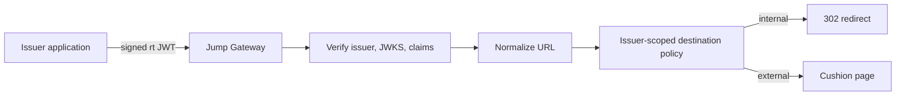
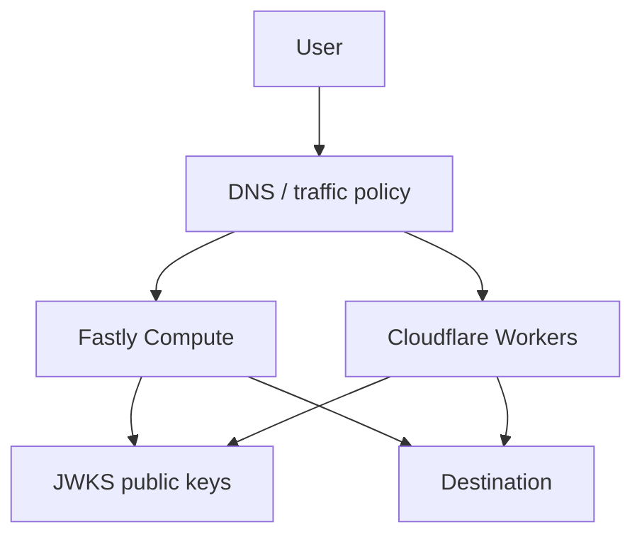

# Architecture

## Purpose

Jump is a redirect trust broker across FQDN boundaries. It receives `https://jump.example.net/?rt=<JWT>`, validates the redirect token, and decides whether the destination is allowed.

Jump exists because direct redirects are easy to turn into OpenRedirect bugs. A source application should not send users across domains based only on a raw query parameter. Jump makes the decision explicit, signed, issuer-scoped, and auditable.

## NON-GOALS

- This project is NOT an authentication provider.
- This project is NOT a session manager.
- This project is NOT a generic proxy.
- This project is NOT a URL shortener.
- This project is NOT a confidential transport.
- This project does NOT hide redirect destinations.
- This project does NOT replace OAuth/OIDC.
- This project is ONLY a redirect trust broker across FQDN boundaries.

## Trust Broker Flow

## Why Direct Redirect Is Forbidden

External direct redirects hide the decision point from users and make phishing failures harder to notice. Jump always renders a cushion page for `dst=external`; the user sees the punycode hostname and the escaped destination URL before continuing.

Internal redirects are allowed only when the issuer registry explicitly allows the normalized origin.

## Why JWT/JWKS

JWT compact JWS gives issuers a portable signed redirect decision. JWKS lets Jump verify issuer keys without sharing private keys with Jump. Token-provided key URLs are forbidden; Jump only uses registry-configured JWKS.

## Stateless Edge Design

Jump uses no cookies, DB, or sessions. The JWT contains the redirect decision, expiry, issuer, audience, `jti`, destination type, and URL. Stateless validation keeps Fastly Compute and Cloudflare Workers behavior simple and resilient.

Replay cache is optional and best-effort. Correctness comes from signature, claim, and policy validation, not from shared storage.

## Active-Active Edge

Fastly and Cloudflare can both serve traffic. Runtime-specific code belongs in adapters; core logic uses Web Standard APIs where possible. Isolate-local caches are acceptable because JWKS and replay state do not require cross-edge consistency.

## Why No Cookies

Cookies would create session semantics, cross-site policy questions, and extra leakage surfaces. Jump ignores `Cookie` and must not emit `Set-Cookie`.

## Security Assumptions

- Issuers protect private signing keys.
- Issuer registry entries are reviewed.
- Destination allowlists use normalized origins.
- Clocks are within configured leeway.
- `rt` is public data and may be stored by browsers or infrastructure.
