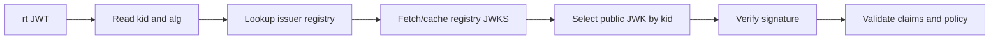
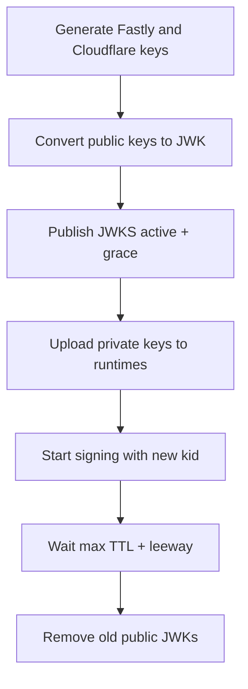

# Key Rotation Procedure

## Purpose

This runbook rotates P-384 signing keys for Fastly and Cloudflare runtimes while keeping Jump verification available.

## Key States

- `active`: used for new signing and verification.
- `grace`: verification only; kept so existing JWTs can expire naturally.
- `retired`: removed from JWKS during normal operation.
- `revoked`: immediately rejected, even if present elsewhere.

## Manual Rotation Steps

1. Generate a new Fastly P-384 key pair.
2. Generate a new Cloudflare P-384 key pair.
3. Derive public keys from the private keys.
4. Convert public keys into JWK format.
5. Add the new public JWKs into `/.well-known/jwks.json`.
6. Keep old public JWKs during the grace period.
7. Upload the new Fastly private key into Fastly Secret Store.
8. Upload the new Cloudflare private key into Cloudflare Secrets.
9. Upload the new Cloudflare `kid` into the matching secret binding.
10. Configure issuers or runtime signing code to start signing with the new `kid`.
11. Verify `/.well-known/jwks.json` returns active and grace public keys.
12. Verify `/health` on Fastly and Cloudflare.
13. Wait `max JWT TTL + leeway`.
14. Remove old public JWKs from JWKS.
15. Confirm old keys are no longer used for signing.

## Compromise Procedure

If compromise is suspected:

1. Skip the grace period.
2. Add the compromised `kid` into the issuer `revoked_kids` list.
3. Deploy immediately.
4. Confirm Jump rejects tokens signed with the revoked `kid`.
5. Generate and deploy new runtime private keys.
6. Review logs for `jti`, issuer hostname, and destination hostname patterns without logging full JWTs.

## Key Generation Examples

Node.js:

```sh
node -e "const { generateKeyPairSync } = require('crypto'); \
const kp = generateKeyPairSync('ec', { namedCurve: 'P-384' }); \
console.log(kp.publicKey.export({format:'pem',type:'spki'})); \
console.log(kp.privateKey.export({format:'pem',type:'pkcs8'}));"
```

OpenSSL:

```sh
openssl genpkey -algorithm EC -pkeyopt ec_paramgen_curve:secp384r1 -out private.pem
openssl pkey -in private.pem -pubout -out public.pem
```

## Public Key Derivation

- Public keys are derived from private keys.
- Private keys are NOT committed into git.
- Public JWKs ARE committed into git.
- JWKS is generated from public keys.
- Runtime environments only store private keys.
- Git repository stores only public keys.

## Repository Policy

- Public repository is allowed.
- Public JWKs are intentionally public.
- Private keys must never exist in git.
- Private keys must never appear in CI logs.
- Private keys must never appear in screenshots.
- Private keys must never appear in example configs.

## Runtime Secret Names

Cloudflare Workers:

- `UMAXICA_JUMP_PRIVATE_KEY_PEM`: ES384 P-384 private key in PKCS#8 PEM format.
- `UMAXICA_JUMP_PRIVATE_KEY_KID`: active outbound signing key id.

Fastly Compute:

- Store the ES384 P-384 private key in Fastly Secret Store.
- Store the active outbound signing key id as companion secret/config.

Issuer registry entries are not private keys. The current production registry is
checked in at `src/config/registry.umaxica.ts`; see
`docs/operations/production-configuration.md`.

## Verification Flow



## Rotation Flow


