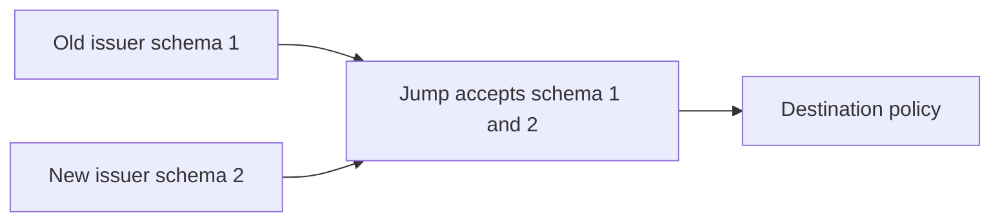

# Schema Migration Procedure

## Purpose

JWT schema migration changes token compatibility. It is independent from service release versioning.

## JWT Schema Versioning

- JWT schema version is independent from service version.
- Initial schema is `schema: 1`.
- Initial service version is `0.1.0`.
- Patch and minor service releases must NOT change schema compatibility.
- Increase schema only when JWT compatibility changes.

## Migration Steps

1. Document the new schema and deprecation date in README and this runbook.
2. Update Jump verification to temporarily support both `schema: 1` and `schema: 2`.
3. Upgrade issuer libraries and copy-paste examples to issue `schema: 2`.
4. Roll out issuer changes before rejecting old tokens.
5. Monitor issuance until all issuers have migrated.
6. After all issuers migrate and the deadline passes, reject `schema: 1`.
7. Remove schema 1 examples and update documentation.

## Required Temporary State

Jump must support multiple schemas during migration:

## Deprecation Date

No `schema: 1` deprecation date is set yet. Add the date here before introducing `schema: 2`.

## Compatibility Rules

- Service patch release: schema stays the same.
- Service minor release: schema stays the same unless JWT compatibility changes.
- JWT compatibility change: schema must increase.
- Issuers must not silently change JWT structure without changing schema.
